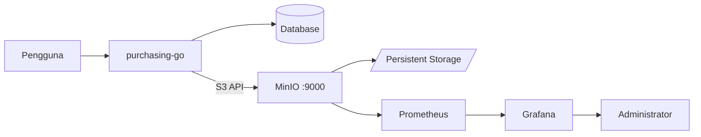

# Architecture — Shared MinIO (purchasing-go)

## 1. Ringkasan

Shared MinIO adalah object storage S3-compatible single-node berbasis Docker Compose. Aplikasi **purchasing-go** mengakses API MinIO secara langsung. Prometheus dan Grafana menyediakan observability. Tidak ada Nginx di stack ini.

## 2. Context Diagram



## 3. Port & Network

Semua service berada di Docker network eksternal `app-bridge` (sama dengan project purchasing-go). Dari container lain di network itu, S3 API diakses sebagai `http://minio:9000`.

| Port host | Service | Catatan |
|---|---|---|
| `MINIO_API_PORT` (default 9000) | S3 API | Dipakai purchasing-go |
| `MINIO_CONSOLE_PORT` (default 9001) | Console | Admin / VPN only |
| `GRAFANA_PORT` (default 3030) | Grafana | Monitoring UI |

Port MinIO tidak boleh diekspos ke internet publik tanpa kontrol akses.

## 4. Path

```text
/opt/sharedminio/          deploy path repo
/srv/sharedminio/data/     object MinIO (MINIO_DATA_PATH)
```

## 5. Bucket & kredensial

| Item | Nilai |
|---|---|
| Bucket privat | `purchasing-go-documents` |
| Bucket publik | `purchasing-go-public-documents` |
| Kredensial app | `PURCHASING_GO_ACCESS_KEY` / `PURCHASING_GO_SECRET_KEY` |

## 6. Retention Monitoring

Prometheus retention dibatasi (default 15 hari) agar monitoring tidak menghabiskan disk.
